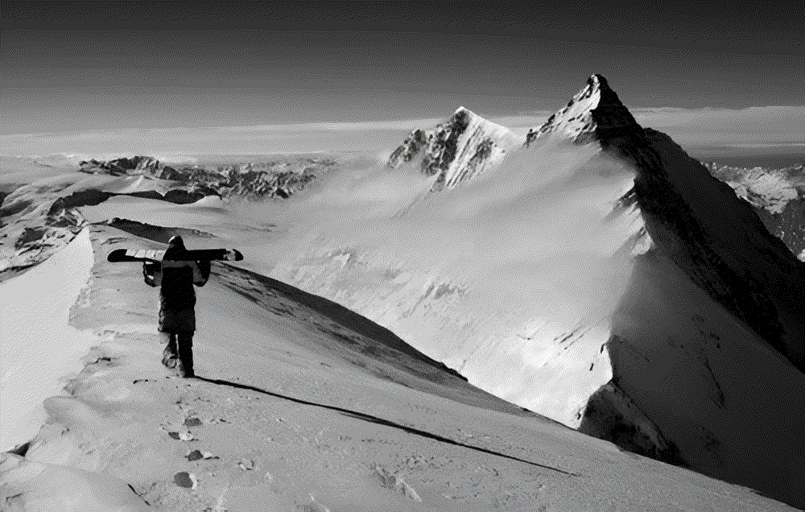

# 🌍 EnduraX – Extreme Sports & Adventure Gear Website  

A modern, fully responsive website built with **HTML5** and **CSS3**, showcasing extreme sports and outdoor adventure gear with a sleek **glassmorphism UI**.  

  

---

## 🔗 Live Demo  
👉 [Check it out here](https://endura-x-tmqz-git-main-aryans-projects-2459726a.vercel.app/)  

---

## 🛠️ Tech Stack  
  
  
  

---

## ✨ Features  
- 📱 **Responsive Design** – works on desktop, tablet & mobile  
- 🎨 **Glassmorphism UI** with smooth gradients & frosted glass elements  
- 🏂 **Adventure Categories** – Surfing, Biking, Climbing, Snowboarding & more  
- 📰 **Newsletter Section** with frosted-glass input & button  
- 📌 **Minimal & Clean Footer** with company info, links, and social icons  

---

## 📸 Screenshots  

### 🏔️ Hero Section  
  

### 📩 Newsletter Section  
  

---

## 🚀 Getting Started  

Clone the repo and open it locally:  

```bash
# Clone this repository
git clone https://github.com/your-username/enduraX.git

# Navigate into the project
cd enduraX

# Open index.html in your browser (or use Live Server in VS Code)
